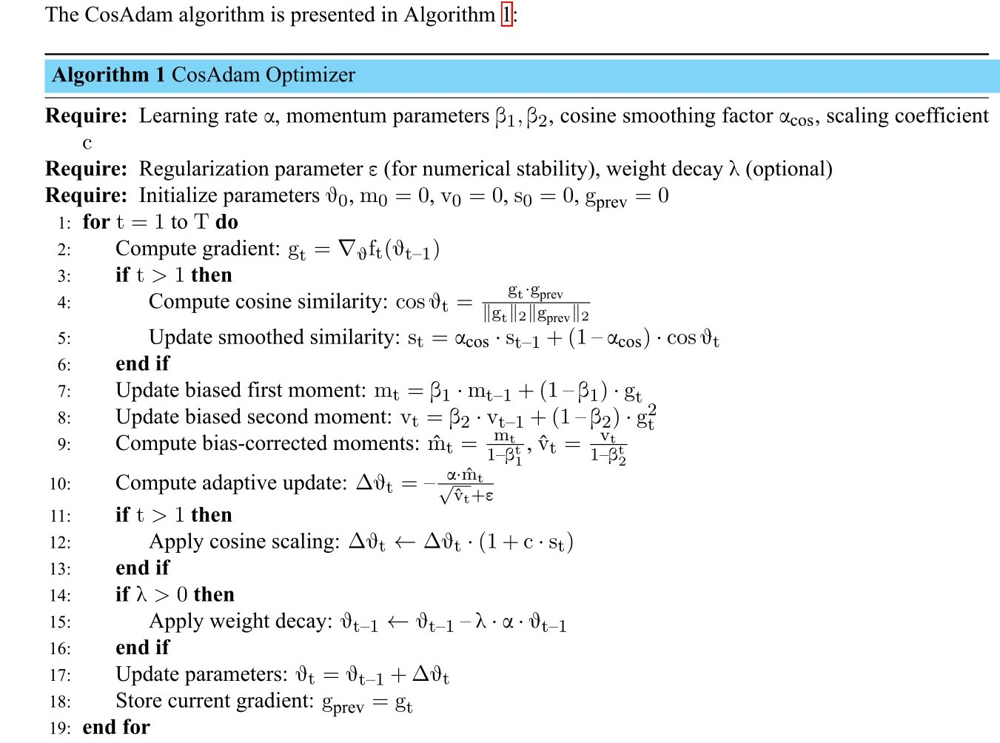
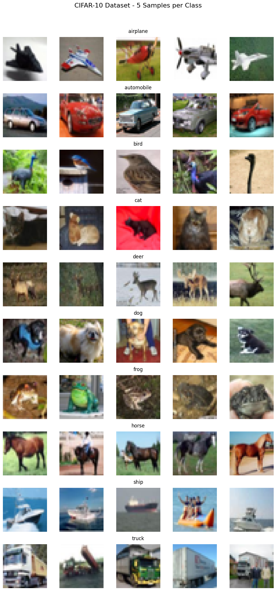
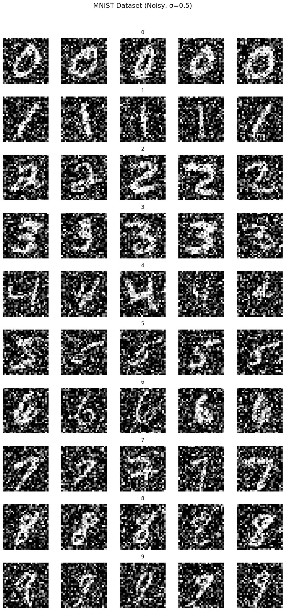

# 🧠✨ **Neurocomputing** ✨🧠  
A **neural networks** project with:  
- 🚀 Fast training  
- 🎨 Visualizations  
- 📊 Performance metrics

<!--# <span style="color:purple">🧠 **Neurocomputing** 🧠</span>  <span style="color:orange">**Key Features:**</span>  
- <span style="color:blue">High-performance neural networks</span>  
- <span style="color:green">Real-time visualization</span>  
 -->


 
<!-- -->


<!--[Python](https://img.shields.io/badge/Python-3.8+-blue?logo=python)  
 -->  

# CosAdam: Cosine Similarity–Guided Adaptive Moment Estimation for Deep Learning Optimization

# Abstract

Optimization in deep neural networks remains a critical challenge, directly influencing training efficiency, convergence behavior, and generalization. First-order adaptive methods, such as Adam, are widely employed due to their computational scalability and parameter-wise learning rate adaptation. However, Adam and its variants often suffer from convergence instability in non-convex landscapes, overfitting due to aggressive adaptation, and sensitivity to hyperparameter tuning. While prior works have attempted to mitigate these issues via techniques like decoupled weight decay, momentum scheduling, or bias correction, these approaches primarily refine existing mechanisms without incorporating novel directional insights. In this work, we identify directional instability the inability of optimizers to distinguish constructive gradient alignment from detrimental oscillations as a fundamental limitation of current adaptive methods. To address this, we propose CosAdam, a novel optimizer that introduces directional consistency monitoring through an exponential moving average of cosine similarity between successive gradients.  At the core of CosAdam is the Directional Consistency Factor (DCF): (\( s_t = \alpha s_{t-1} + (1-\alpha) \frac{g_t \cdot g_{t-1}}{\|g_t\| \|g_{t-1}\|} \))  which adaptively modulates the step size. When successive gradients are well-aligned ($s_t \rightarrow 1$), the step size is amplified, promoting rapid convergence. Conversely, when gradients point in opposing directions ($s_t \rightarrow -1$), typically due to noisy or unstable updates, the step size is suppressed to maintain stability. CosAdam maintains $\mathcal{O}(N)$ ($N$ is the total number of model parameters) time and space complexity, with minimal overhead, and integrates seamlessly with AdamW-style decoupled weight decay. Extensive evaluations on CIFAR-10, MNIST, noisy MNIST, and SST-2 benchmarks demonstrate its superiority: achieving 89.09\% accuracy on CIFAR-10 (vs. 81.15\% for Adam and 88.13\% for AdamW), 82.91\% on SST-2, and 96.64\% with a 96.61\% F1-score on noisy MNIST. Empirical and theoretical analyses confirm improved convergence and robustness in noisy and non-stationary regimes. CosAdam emerges as a robust, drop-in replacement for existing optimizers, particularly effective in scenarios demanding directional stability. 


## CosAdam Algorithm


## Algorithm Pseudocode
Here’s the visual representation of the algorithm:




## Code of CosAdam Optimizer
```python
# ---------------------------
# CosAdam Optimizer (Improved Implementation)
# ---------------------------
class CosAdam(optim.Optimizer):
    """Implements CosAdam: Adam with cosine similarity-based step adjustment."""
    def __init__(self, params, lr=1e-3, betas=(0.9, 0.999), eps=1e-8,
                 weight_decay=0, alpha=0.9, c=0.5):
        defaults = dict(lr=lr, betas=betas, eps=eps,
                        weight_decay=weight_decay, alpha=alpha, c=c)
        super(CosAdam, self).__init__(params, defaults)

    def step(self, closure=None):
        loss = None
        if closure is not None:
            loss = closure()

        for group in self.param_groups:
            for p in group['params']:
                if p.grad is None:
                    continue
                grad = p.grad.data
                state = self.state[p]

                # Initialize state
                if len(state) == 0:
                    state['step'] = 0
                    state['exp_avg'] = torch.zeros_like(p.data)
                    state['exp_avg_sq'] = torch.zeros_like(p.data)
                    state['prev_grad'] = torch.zeros_like(p.data)
                    state['s'] = 0.0  # Smoothed cosine similarity

                exp_avg, exp_avg_sq = state['exp_avg'], state['exp_avg_sq']
                prev_grad, s = state['prev_grad'], state['s']
                beta1, beta2 = group['betas']
                state['step'] += 1

                # Cosine similarity calculation (skip first step)
                if state['step'] > 1:
                    cos_theta = torch.cosine_similarity(grad.flatten(),
                                                       prev_grad.flatten(), dim=0)
                    s = group['alpha'] * s + (1 - group['alpha']) * cos_theta.item()
                state['s'] = s

                # Adam update components
                exp_avg.mul_(beta1).add_(grad, alpha=1 - beta1)
                exp_avg_sq.mul_(beta2).addcmul_(grad, grad, value=1 - beta2)

                # Bias correction
                bias_correction1 = 1 - beta1 ** state['step']
                bias_correction2 = 1 - beta2 ** state['step']
                denom = (exp_avg_sq.sqrt() / np.sqrt(bias_correction2)).add_(group['eps'])
                step_size = group['lr'] / bias_correction1

                # Apply cosine scaling
                update = -step_size * exp_avg / denom
                update.mul_(1 + group['c'] * s)

                # Weight decay (AdamW style)
                if group['weight_decay'] != 0:
                    p.data.add_(p.data, alpha=-group['weight_decay'] * group['lr'])

                p.data.add_(update)
                state['prev_grad'].copy_(grad)

        return loss
```

\subsection{Why CosAdam Outperforms Other Optimizers?}

In the domain of deep learning optimization, the CosAdam optimizer demonstrates superior performance compared to traditional methods such as stochastic gradient descent (SGD) with momentum, Adam, AdamW, Nadam, and RMSprop. This advantage stems from its novel incorporation of cosine similarity between consecutive gradients, enabling dynamic modulation of update steps based on gradient direction consistency. Below, we outline the key reasons for CosAdam’s enhanced performance, supported by its algorithmic design and empirical evidence.

The CosAdam optimizer introduces a novel mechanism for modulating parameter updates based on the cosine similarity of successive gradients. By incorporating directional information directly into the adaptive update rule, CosAdam achieves faster convergence, greater stability in non-convex landscapes, and improved generalization compared to standard optimizers such as Adam, RMSProp, and SGD variants.

CosAdam augments the Adam optimizer by introducing a cosine similarity term, defined as $\cos\theta_t = \frac{g_t \cdot g_{t-1}}{\|g_t\|_2 \|g_{t-1}\|_2}$, where $g_t$ is the current gradient and $g_{t-1}$ is the previous gradient. This term is smoothed using an exponential moving average, $s_t = \alpha_{\text{cos}} \cdot s_{t-1} + (1 - \alpha_{\text{cos}}) \cdot \cos\theta_t$, and scales the update via a multiplicative factor $(1 + c \cdot s_t)$ in the update rule: $\theta_t = \theta_{t-1} - \alpha \frac{\hat{m}_t}{\sqrt{\hat{v}_t} + \epsilon} \cdot (1 + c \cdot s_t)$, where $\hat{m}_t = \frac{m_t}{1 - \beta_1^t}$ and $\hat{v}_t = \frac{v_t}{1 - \beta_2^t}$. This directional awareness allows CosAdam to adaptively adjust step sizes based on the local geometry of the loss landscape, offering several key advantages.


 In what follows, we elaborate on the key reasons for this performance gain.


\begin{enumerate}

\item{\bf Directional awareness via cosine similarity}:

Traditional adaptive methods (e.g., Adam) rely solely on the magnitude of past gradients (first and second moments) to scale each coordinate’s learning rate. CosAdam augments this by computing the cosine similarity between the current gradient \(g_t\) and the previous gradient \(g_{t-1}\):
\begin{equation}
\cos\theta_t \;=\; \frac{g_t \cdot g_{t-1}}{\|g_t\|_2 \,\|g_{t-1}\|_2}\,.
\end{equation}
A positive value of \(\cos\theta_t\) indicates that successive gradients point in a similar direction, suggesting that the optimizer is traversing a relatively smooth or consistently sloped region of the loss surface. Conversely, a negative or near‐zero cosine similarity signals oscillation or abrupt changes in curvature. By smoothing this quantity via an exponential moving average
\begin{equation}
s_t \;=\; \alpha_{\text{cos}}\,s_{t-1} \;+\;(1 - \alpha_{\text{cos}})\,\cos\theta_t,
\end{equation}
CosAdam develops an explicit sense of \emph{directional agreement}. This directional awareness allows CosAdam to amplify updates when gradients are aligned and  attenuate them when gradients oscillate, thereby reducing unnecessary parameter noise in high‐curvature or saddle‐point regions.

\item{\bf  Adaptive step scaling in flat versus oscillatory regions}:

CosAdam’s core update rule can be written as:
\begin{equation}
\Delta \theta_t \;=\; -\,\alpha\,\frac{\widehat{m}_t}{\sqrt{\widehat{v}_t} + \epsilon}
\;\times\;\bigl(1 + c \,s_t \bigr)\,,
\end{equation}
where
\[
\widehat{m}_t \;=\; \frac{m_t}{1 - \beta_1^t},
\qquad
\widehat{v}_t \;=\; \frac{v_t}{1 - \beta_2^t},
\]
and \(s_t\) is the smoothed cosine similarity. The multiplicative factor \(\bigl(1 + c\,s_t\bigr)\) yields:
\begin{itemize}
    \item \textbf{Positive scaling} (\(s_t > 0\)): In regions where gradients remain consistently aligned (e.g., shallow valleys or plateaus), \(1 + c\,s_t > 1\). Thus, the effective step size is \emph{increased}, accelerating convergence along a stable descent direction and reducing the number of iterations needed to escape flat regions.
    \item \textbf{Dampened scaling} (\(s_t < 0\)): When gradients oscillate or reverse direction (indicating sharp curvature or saddle points), \(1 + c\,s_t < 1\). Consequently, CosAdam \emph{reduces} the update magnitude, preventing large, erratic jumps that often cause divergence or slow down progress in non-convex settings.
    \item \textbf{Neutral scaling} (\(s_t \approx 0\)): If gradients are nearly orthogonal from one iteration to the next, then \(1 + c\,s_t \approx 1\), and CosAdam effectively behaves like standard Adam in that region maintaining stability without introducing bias.
\end{itemize}
This implicit learning‐rate adaptation based on gradient alignment cannot be achieved by fixed schedules or heuristics alone, as CosAdam continuously and automatically adjusts itself to the local geometry of the loss surface.


\item \textbf{Adaptive scaling based on gradient direction consistency:} When gradients align ($s_t > 0$), indicating a smooth or consistently sloped region, the factor $(1 + c \cdot s_t) > 1$ amplifies the update magnitude, accelerating convergence. Conversely, in oscillatory regions ($s_t < 0$), such as near sharp minima or saddle points, the factor $(1 + c \cdot s_t) < 1$ reduces the update magnitude, enhancing stability and preventing erratic jumps. If gradients are nearly orthogonal ($s_t \approx 0$), CosAdam behaves similarly to Adam, maintaining stability without bias. Unlike AdamW, which incorporates weight decay, or Nadam, which uses Nesterov momentum, CosAdam’s directional sensitivity enables it to adapt more effectively to the loss landscape.

\item \textbf{Enhanced stability through smoothed cosine similarity:} The smoothed $s_t$ mitigates sensitivity to gradient noise, ensuring robustness in high-dimensional or noisy problems. This contrasts with AdamW and Nadam, which rely solely on moment estimates and may struggle in such scenarios, often leading to oscillations or slow convergence in complex loss landscapes.

\item \textbf{Retention of Adam’s core strengths:} CosAdam preserves Adam’s adaptive learning rates, maintaining robustness to sparse gradients while introducing directional adaptability. This surpasses AdamW’s weight decay and Nadam’s momentum-based approaches, as CosAdam combines moment-based rescaling with cosine-driven feedback for greater flexibility.

\item \textbf{Superior handling of non-stationary objectives:} CosAdam’s sensitivity to gradient direction shifts enables effective adaptation to non-stationary objectives, outperforming AdamW and Nadam, which adjust more slowly due to their reliance on historical moments. This makes CosAdam particularly effective for dynamic or evolving loss functions.

\item \textbf{Improved generalization:} By favoring consistent gradient directions and dampening oscillations, CosAdam encourages smoother parameter trajectories, potentially targeting flatter minima that correlate with better generalization. This implicit regularization offers advantages over AdamW’s explicit regularization and Nadam’s convergence speed, reducing the generalization gap on deep convolutional and transformer models. Empirical results demonstrate that CosAdam leads to higher test accuracy and better generalization across diverse datasets such as CIFAR-10, MNIST, SST-2, and noisy MNIST. Notably, CosAdam outperforms Adam, AdamW, RMSprop, SGD, and Nadam in terms of accuracy, precision, recall, and F1-score across all these benchmarks (see Tables \ref{tab:cifar10_results_cosadam}–\ref{tab:noisy_mnist_results_cosadam}).

\item \textbf{Low computational overhead:} Despite requiring additional computations (one dot product and two norms per iteration), CosAdam’s overhead is $\mathcal{O}(n)$, where $n$ is the parameter dimension. This is negligible compared to the forward and backward passes of modern neural networks, ensuring scalability comparable to Adam while providing second-order-inspired directional intelligence.


\item \textbf{Robustness to noisy data:} As evidenced in Table \ref{tab:noisy_mnist_results_cosadam}, CosAdam achieves superior performance on noisy datasets, indicating enhanced robustness compared to standard optimizers. For example, on the noisy MNIST dataset, CosAdam attained a test accuracy of 96.64\%, outperforming all baselines.


\item \textbf{Tunable cosine parameters:}  CosAdam introduces new hyperparameters such as $\alpha$ and $c$, which govern the influence of the cosine similarity. These parameters can be adjusted to fine-tune the optimizer's behavior, as shown in Table \ref{tab:CosAdam_mnist_hyperparams}, where different combinations yield test accuracies up to 99.26\% on MNIST.


\item \textbf{Explanation of CosAdam's overhead:}

CosAdam introduces one key operation not present in other optimizers:

\begin{itemize}
    \item \textbf{Cosine similarity between current and previous gradients:} This adds an $\mathcal{O}(N)$ dot product and norm computation per parameter tensor.
    \item However, this operation is cheap compared to the backward pass and matrix operations, and can be vectorized efficiently in PyTorch or NumPy.
\end{itemize}


CosAdam maintains the same asymptotic time and space complexity as Adam and Nadam ($\mathcal{O}(N)$), while offering potential improvements in convergence through cosine similarity-based dynamic step scaling. It’s a smart enhancement with minimal cost, especially useful for:

\begin{itemize}
    \item Highly non-convex losses
    \item Fluctuating gradient directions
    \item Tasks where directional consistency helps convergence
\end{itemize}


## Performance Metrics on CIFAR-10 with CosAdam

| Optimizer | Train Loss | Train Acc (%) | Val Acc (%) | Test Loss | Test Acc (%) | Precision (%) | Recall (%) | F1-Score (%) | Epoch Time (s) |
|-----------|-----------|--------------|------------|----------|-------------|--------------|-----------|-------------|---------------|
| CosAdam   | 0.1678    | 94.16        | 89.26      | 0.3525   | 89.09       | 89.12        | 89.09     | 89.04       | 46.96         |
| AdamW     | 0.1640    | 94.30        | 88.94      | 0.4029   | 88.13       | 88.61        | 88.13     | 87.88       | 40.96         |
| Adam      | 0.4753    | 84.49        | 82.22      | 0.5501   | 81.15       | 82.81        | 81.15     | 81.34       | 40.44         |
| RMSprop   | 0.6906    | 76.79        | 70.72      | 0.8581   | 69.70       | 74.47        | 69.70     | 69.99       | 39.14         |
| SGD       | 0.8780    | 68.80        | 68.04      | 0.9171   | 67.57       | 67.74        | 67.57     | 67.35       | 40.36         |
| Nadam     | 0.4187    | 86.80        | 83.52      | 0.5106   | 82.87       | 83.54        | 82.87     | 82.58       | 40.82         |

## Performance Metrics on MNIST with CosAdam

| Optimizer | Train Loss | Train Acc (%) | Val Acc (%) | Test Loss | Test Acc (%) | Precision (%) | Recall (%) | F1-Score (%) | Epoch Time (s) |
|-----------|-----------|--------------|------------|----------|-------------|--------------|-----------|-------------|---------------|
| CosAdam   | 0.0131    | 99.59        | 98.78      | 0.0310   | 99.13       | 99.13        | 99.12     | 99.13       | 14.76         |
| AdamW     | 0.0155    | 99.51        | 98.66      | 0.0280   | 99.07       | 99.06        | 99.06     | 99.06       | 13.04         |
| Adam      | 0.0730    | 97.97        | 97.92      | 0.0565   | 98.30       | 98.32        | 98.27     | 98.29       | 12.64         |
| RMSprop   | 0.0753    | 97.92        | 97.88      | 0.0554   | 98.43       | 98.42        | 98.43     | 98.42       | 12.66         |
| SGD       | 0.1342    | 96.10        | 96.64      | 0.0967   | 97.08       | 97.08        | 97.06     | 97.07       | 12.64         |
| Nadam     | 0.0725    | 97.98        | 97.96      | 0.0526   | 98.52       | 98.52        | 98.50     | 98.51       | 12.95         |

## Performance Metrics on SST-2 with CosAdam

| Optimizer | Train Loss | Train Acc (%) | Val Acc (%) | Test Loss | Test Acc (%) | Precision (%) | Recall (%) | F1-Score (%) | Epoch Time (s) |
|-----------|-----------|--------------|------------|----------|-------------|--------------|-----------|-------------|---------------|
| CosAdam   | 0.1600    | 94.19        | 91.09      | 0.6019   | 82.91       | 82.91        | 82.91     | 82.91       | 16.50         |
| AdamW     | 0.1607    | 94.28        | 90.76      | 0.6187   | 81.88       | 82.23        | 81.78     | 81.79       | 15.28         |
| Adam      | 0.6456    | 63.45        | 63.80      | 0.6398   | 65.94       | 68.72        | 65.57     | 64.30       | 15.37         |
| RMSprop   | 0.6480    | 62.99        | 63.37      | 0.6422   | 65.94       | 69.05        | 65.55     | 64.15       | 15.24         |
| SGD       | 0.6780    | 57.10        | 57.58      | 0.6810   | 54.47       | 56.64        | 53.88     | 48.85       | 14.95         |
| Nadam     | 0.6457    | 63.39        | 63.73      | 0.6399   | 66.17       | 68.84        | 65.81     | 64.61       | 15.51         |

## Performance Metrics on Noisy MNIST with CosAdam

| Optimizer | Train Loss | Train Acc (%) | Val Acc (%) | Test Loss | Test Acc (%) | Precision (%) | Recall (%) | F1-Score (%) | Epoch Time (s) |
|-----------|-----------|--------------|------------|----------|-------------|--------------|-----------|-------------|---------------|
| CosAdam   | 0.1360    | 95.64        | 95.84      | 0.1042   | 96.64       | 96.61        | 96.63     | 96.61       | 8.59          |
| AdamW     | 0.1481    | 95.33        | 96.18      | 0.1095   | 96.12       | 96.13        | 96.08     | 96.10       | 7.14          |
| Adam      | 0.1438    | 95.41        | 96.22      | 0.1124   | 96.31       | 96.29        | 96.29     | 96.28       | 7.39          |
| RMSprop   | 0.3493    | 88.92        | 90.78      | 0.2732   | 91.38       | 91.34        | 91.27     | 91.29       | 7.24          |
| SGD       | 0.1423    | 95.50        | 95.54      | 0.1046   | 96.58       | 96.56        | 96.56     | 96.55       | 7.19          |
| Nadam     | 0.1453    | 95.40        | 95.76      | 0.1078   | 96.52       | 96.51        | 96.48     | 96.49       | 7.21          |

## CosAdam Hyperparameter Combinations on MNIST

| Comb. | LR     | β₁  | β₂   | WD    | α    | c  | Test Acc (%) | Precision (%) | Recall (%) | F1-Score (%) |
|-------|--------|-----|------|-------|------|----|--------------|---------------|------------|--------------|
| Comb1 | 0.001  | 0.9 | 0.999 | 0.01  | 0.9  | 0.5 | 99.26        | 99.26         | 99.25      | 99.25        |
| Comb2 | 0.001  | 0.95| 0.999 | 0.001 | 0.95 | 0.7 | 99.21        | 99.21         | 99.20      | 99.20        |
| Comb3 | 0.01   | 0.9 | 0.99  | 0.01  | 0.8  | 0.3 | 98.78        | 98.77         | 98.76      | 98.76        |
| Comb4 | 0.001  | 0.9 | 0.99  | 0.005 | 0.85 | 0.5 | 99.05        | 99.04         | 99.04      | 99.04        |
| Comb5 | 0.0005 | 0.8 | 0.999 | 0.0   | 0.9  | 0.6 | 98.90        | 98.90         | 98.88      | 98.89        |




